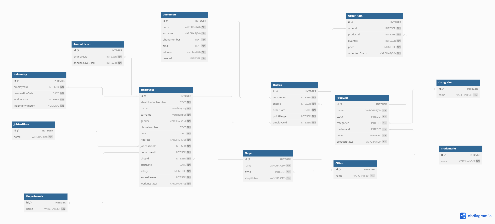

# CS50-SQL-FINAL-PROJECT
<a href="https://drive.google.com/file/d/1hMLdIjNCOwN-NCuetewx-gsN5mixDDKY/view?usp=drive_link">Certificate</a>
# Design Document

By Muhammed Ahmet Sekerci

Video overview: https://www.youtube.com/watch?v=4YJtizONyW8

## Scope

This database is designed to easily store the data of a technology company's customers, employees and orders. As such, included in the database's scope is:

* **Customers** Contains customer identification information and deletion information
* **Trademarks** Includes product brands
* **Categories** Includes product categories
* **Products** It Product information is kept here
* **Cities** cities are found in this table
* **Shops**  Information about the store is kept in this table.
* **Departments** department information is found in this table
* **JobPositions** job positions are found in this table
* **Employees** Basic information of the employees + job position information, department information, store information about which store they are in, starting date, salary, number of leaves and working status information are included in this table.
* **Indemnity** Employee compensation information is included in this table.
* **Annual_Leave** The leaves used by employees are listed in this table.
* **Orders** The store where the order was placed, the employee who sold it and the customer who purchased it, and the date it was sold are included in this table.
* **Order_Item** When an order is placed, the basket information for that order is included in this table.

* Other elements provided by a tech store are excluded example;
-customer point
-employee bonus
-Extra information for each shop

## Functional Requirements

**Customers**
Can create orders, list them, and return orders.
Can view information about products and stores

## Representation

### Entities

**Customers:**

<ul>
<li> <code>"id"</code> indicates the identification number. For this reason <code>INTEGER</code>. Is the data type. There is always an ID of the customer <code> PRIMARY KEY </code>. ID number will be added automatically <code>AUTOINCREMENT</code>.</li>
<li> <code>"name"</code> Customer name should not exceed 40 characters <code> VARCHAR(40). </code> This line cannot be empty <code>NOT NULL</code>.</li>
<li> <code>"surname"</code> customer surname information. Cannot exceed 20 characters <code>VARCHAR(20)</code>. This line cannot be empty <code>NOT NULL</code>.</li>
<li> <code>"phoneNumber"</code> represents the phone number. Because there are variable length <code>TEXT</code>. This line cannot be empty. <code>NOT NULL</code>. Must be unique <code>UNIQUE</code>. Must contain only numbers <code>CHECK("phoneNumber" GLOB '*[0-9]*')</code>. </li>
<li> <code>"email"</code> because it will contain special characters <code>TEXT</code>. This line cannot be empty. <code>NOT NULL</code>  Must be unique <code>UNIQUE</code>. @ sign control <code>CHECK("email" LIKE '%@%'</code>).</li>
<li> <code>"address"</code> address information. Should not exceed 70 characters <code>NVARCHAR(70)</code>. This line cannot be empty <code>NOT NULL</code>.</li>
<li> <code>"deleted"</code> This line will be used if the customer is deleted. There will be only numbers <code>INTEGER</code>. It should be automatically 0 when the customer first becomes a member, it has not been deleted yet <code>DEFAULT 0</code>. This line cannot be empty <code>NOT NULL</code>. Only deleted or not deleted will be checked 0 or 1 <code>CHECK("deleted" BETWEEN 0 AND 1).</code></li>
</ul>

**Trademarks:**

<ul>
<li> <code>"id"</code> indicates the identification number. For this reason <code>INTEGER</code>. Every brand should have a unique identity <code>PRIMARY KEY</code>. Id should be auto incrementing <code>AUTOINCREMENT</code>.</li>
<li> <code>"name"</code> indicates the brand name. Brand name should not exceed 50 characters <code>VARCHAR(50)</code>. Should not be empty <code>NOT NULL</code>. Must be unique <code>UNIQUE</code>. </li>
</ul>

**Categories:**

<ul>
<li> <code>"id"</code> indicates the identification number. For this reason <code>INTEGER</code>. Each category should be unique <code>PRIMARY KEY</code>. Id should be auto incrementing <code>AUTOINCREMENT</code>.</li>
<li> <code>"name"</code>indicates the category name. Category name should not exceed 50 characters <code>VARCHAR(50)</code>. Should not be empty <code>NOT NULL</code>. Category name must be unique <code>UNIQUE</code>. </li>
</ul>

**Products:**

<ul>
<li> <code>"id"</code> product indicates the identification number. For this reason <code>INTEGER</code>. Every product should be unique <code>PRIMARY KEY</code>. Id should be auto incrementing <code>AUTOINCREMENT</code>. </li>
<li> <code>"name"</code> indicates the product name. Product name should not exceed 50 characters <code>VARCHAR(50)</code>. Should not be empty <code>NOT NULL</code>.</li>
<li> <code>"stock"</code> Indicates the number of stocks. The number of stocks must be numerical <code>INTEGER</code>. Should not be empty <code>NOT NULL</code>. Stock - should not be <code>CHECK("stock" >= 0)</code>.</li>
<li> <code>"categoryId"</code> Specifies the category number. Category number must be numeric <code>INTEGER</code>. Should not be empty <code>NOT NULL</code>. The <code>FOREIGN KEY</code> constraint applied to the 'id' column in the 'Categories' table is restricted. </li>
<li> <code>"trademarkId"</code> Specifies the trademark number. Trademark number must be numeric <code>INTEGER</code>. Should not be empty <code>NOT NULL</code>. The <code>FOREIGN KEY</code> constraint applied to the 'id' column in the 'Trademarks' table is restricted. </li>
<li><code>"price"</code> indicates the product price. Fee must be numerical <code>NUMERIC</code>. Should not be empty <code>NOT NULL</code>. Fee - should not be <code>CHECK("price" > 0)</code>. </li>
<li> <code>"productStatus"</code> Indicates the status of the product. Status should not exceed 20 characters <code>VARCHAR(20)</code>. Should not be empty <code>NOT NULL</code>. The product status should include some options <code>CHECK("productStatus" IN ('sale','not on sale','stock expected')</code>. </li>  
A brand cannot have more than one product with the same name. <code> CONSTRAINT unique_product_trademark UNIQUE ("trademarkId", "name").</code>
</ul>

**Cities:**

<ul>
<li> <code>"id"</code> Shows city ID number. For this reason <code>INTEGER</code>. Each city number must be unique <code>PRIMARY KEY</code>. Id should be auto incrementing <code>AUTOINCREMENT</code>. </li>
<li> <code>"name"</code> Specifies the city name. City name should not exceed 50 characters <code>VARCHAR(50)</code>. Should not be empty <code>NOT NULL</code>.</li>
</ul>

**Shops:**

<ul>
<li> <code>"id"</code> Shows Shop ID number. For this reason <code>INTEGER</code>. Each shop number must be unique <code>PRIMARY KEY</code>. Id should be auto incrementing <code>AUTOINCREMENT</code>. </li>
<li> <code>"name"</code> Specifies the shop name. Shop name should not exceed 50 characters <code>VARCHAR(50)</code>. Should not be empty <code>NOT NULL</code>. </li>
<li> <code>"cityId"</code> Indicates the city number where it is located. For this reason <code>INTEGER</code>. Should not be empty <code>NOT NULL</code>. The <code>FOREIGN KEY</code> constraint applied to the 'id' column in the 'Cities' table is restricted.</li>
<li> <code>"shopStatus"</code> Indicates shop status. Status should not exceed 12 characters <code>VARCHAR(12)</code>. Should not be empty <code>NOT NULL</code>. Shop status should contain some options <code>CHECK("shopStatus" IN('active', 'repair','not active')</code>. </li>
</ul>

**Departments:**

<ul>
<li> <code>"id"</code> indicates the identification number. For this reason <code>INTEGER</code>. Each department should be unique <code>PRIMARY KEY</code>. Id should be auto incrementing <code>AUTOINCREMENT</code>.</li>
<li> <code>"name"</code> Specifies the department name. Department name should not exceed 30 characters <code>VARCHAR(30)</code>. Should not be empty <code>NOT NULL</code>. Department name must be unique <code>UNIQUE</code>. </li>
</ul>

**JobPositions:**

<ul>
<li> <code>"id"</code> indicates the identification number. For this reason <code>INTEGER</code> Every job position should be unique <code>PRIMARY KEY</code>. Id should be auto incrementing <code>AUTOINCREMENT</code>.</li>
<li> <code>"name"</code> Specifies the job position name. job position name should not exceed 50 characters <code>VARCHAR(50)</code> should not be empty <code>NOT NULL</code> job position name must be unique <code>UNIQUE</code>. </li>
</ul>

**Employees:**

<ul>
<li> <code>"id"</code> indicates the identification number. For this reason <code>INTEGER</code>. Every employee must be unique <code>PRIMARY KEY</code>. Id should be auto incrementing <code>AUTOINCREMENT</code>.</li>
<li> <code>"identificationNumber"</code> represents the employee population identification number. Can contain numbers and letters <code>TEXT</code>. Should not be empty <code>NOT NULL</code>. Identification number must be unique <code>UNIQUE</code>.</li>
<li> <code>"name"</code> specifies the employee name. Employee name should not exceed 50 characters <code>VARCHAR(50)</code>. Should not be empty <code>NOT NULL</code>.</li>
<li> <code>"surname"</code> Specifies the employee surname. Employee surname should not exceed 50 characters <code>VARCHAR(50)</code>. Should not be empty <code>NOT NULL</code>.</li>
<li> <code>"gender"</code> Specifies gender information. Gender information should not exceed 15 characters <code>VARCHAR(15)</code>. Should not be empty <code>NOT NULL</code>.</li>
<li> <code>"phoneNumber"</code> Specifies the working phone number. There are variable length <code>TEXT</code>. This line cannot be empty <code>NOT NULL</code>. Must be unique <code>UNIQUE</code>. Must contain only numbers <code>CHECK("phoneNumber" GLOB '*[0-9]*')</code>. </li>
<li> <code>"email"</code> Specifies the employee e-mail address. It will contain special characters <code>TEXT</code>. This line cannot be empty <code>NOT NULL</code>.  Must be unique <code>UNIQUE</code>. @ sign control <code>CHECK("email" LIKE '%@%'</code>).</li>
<li> <code>"address"</code> represents address information. Cannot exceed 70 characters <code>NVARCHAR(70)</code>. This line cannot be empty <code>NOT NULL</code>.</li>
<li> <code>"jobPositionId"</code> indicates the job position number. For this reason <code>INTEGER</code>. This line cannot be empty <code>NOT NULL</code>. The <code>FOREIGN KEY</code> constraint applied to the 'id' column in the 'JobPositions' table is restricted.</li>
<li> <code>"departmentId"</code> indicates the department number. For this reason <code>INTEGER</code>. This line cannot be empty <code>NOT NULL</code>. The <code>FOREIGN KEY</code> constraint applied to the 'id' column in the 'Departments' table is restricted. </li>
<li> <code>"shopId"</code> Shows the store number where it is located. for this reason <code>INTEGER</code>. this line cannot be empty. <code>NOT NULL</code>. The <code>FOREIGN KEY</code>. Constraint applied to the 'id' column in the 'Shops' table is restricted. </li>
<li> <code>"startDate"</code> this job Date of start <code>DATE</code>. because it contains date. This line cannot be empty <code>NOT NULL</code>. Automatically gets the start date. <code>DEFAULT CURRENT_DATE</code> </li>
<li> <code>"salary"</code> Contains salary information. Salary must be numerical <code>NUMERIC</code>. This line cannot be empty <code>NOT NULL</code>. Must be greater than 0 <code>CHECK("indemnityAmount" >= 0)</code>.</li>
<li> <code>"annualLeave"</code> Contains the number of permissions it has. For this reason <code>INTEGER</code>. This line cannot be empty <code>NOT NULL</code>. The automatically assigned value is 0 <code>DEFAULT 0</code>. Must be greater than 0 <code>CHECK("annualLeave" > 0)</code></li>
<li> <code>"shopStatus"</code> Shows the employee's working status. Status should not exceed 10 characters <code>VARCHAR(10)</code>. Should not be empty <code>NOT NULL</code>. Employeestatus should contain some options <code>CHECK("workingStatus" IN ('work','annual leave','terminated')</code>. </li>
</ul>

**Indemnity:**

<ul>
<li> <code>"id"</code> indicates the identification number. For this reason <code>INTEGER</code> Each compensation must be unique <code>PRIMARY KEY</code>. Id should be auto incrementing <code>AUTOINCREMENT</code>.</li>
<li> <code>"employeeId"</code> Shows the employee's number for this reason <code>INTEGER</code>. This line cannot be empty <code>NOT NULL</code>. The <code>FOREIGN KEY</code> constraint applied to the 'id' column in the 'Employees' table is restricted. </li>
<li> <code>"terminationDate"</code> date of compensation. Data type <code>DATE</code>. This line cannot be empty <code>NOT NULL</code>. Automatically gets that day's date <code>DEFAULT CURRENT_DATE</code>. </li>
<li> <code>"workingDay"</code> total number of days worked by the employee. For this reason <code>INTEGER</code>. This line cannot be empty <code>NOT NULL</code>. Must be greater than 0
<code>CHECK("workingDay" > 0)</code>. </li>
<li> <code>"indemnityAmount"</code> Contains compensation fee information. Fee must be numerical <code>NUMERIC</code>. This line cannot be empty <code>NOT NULL</code>. Must be greater than 0 <code>CHECK("indemnityAmount" >= 0)</code>. </li>
</ul>

**Annual_Leave:**

<ul>
<li> <code>"id"</code> indicates the identification number. For this reason <code>INTEGER</code>. Each compensation must be unique <code>PRIMARY KEY</code>. Id should be auto incrementing <code>AUTOINCREMENT</code>.</li>
<li> <code>"employeeId"</code> Shows the employee's number. For this reason <code>INTEGER</code>. This line cannot be empty <code>NOT NULL</code>. The <code>FOREIGN KEY</code> constraint applied to the 'id' column in the 'Employees' table is restricted. </li>
<li> <code>"annualLeaveUsed"</code> number of permissions used. For this reason <code>INTEGER</code>. This line cannot be empty. <code>NOT NULL</code></li>
</ul>

**Orders:**

<ul>
<li> <code>"id"</code> indicates the identification number. For this reason <code>INTEGER</code>. Each order must be unique <code>PRIMARY KEY</code>. Id should be auto incrementing <code>AUTOINCREMENT</code>.</li>
<li> <code>"customerId"</code> customer ID who placed the order. For this reason <code>INTEGER</code>. This line cannot be empty <code>NOT NULL</code>. The <code>FOREIGN KEY</code> constraint applied to the 'id' column in the 'Customers' table is restricted.</li>
<li> <code>"shopId"</code> Store number where the order was placed. For this reason <code>INTEGER</code> This line cannot be empty <code>NOT NULL</code>.  The <code>FOREIGN KEY</code> constraint applied to the 'id' column in the 'Shops' table is restricted. </li>
<li> <code>"orderDate"</code> Includes order date. For this reason <code>DATE</code>. This line cannot be empty <code>NOT NULL</code>. Automatically gets that day's date <code>DEFAULT CURRENT_DATE</code>. </li>
<li> <code>"employeeId"</code> Shows the number of the Employee who created the order. For this reason <code>INTEGER</code>. This line cannot be empty <code>NOT NULL</code>. The <code>FOREIGN KEY</code> constraint applied to the 'id' column in the 'Employees' table is restricted. </li>
</ul>

**Order_Item:**

<ul>
<li> <code>"id"</code> indicates the identification number. For this reason <code>INTEGER</code>. Each order-item must be unique <code>PRIMARY KEY</code>. Id should be auto incrementing <code>AUTOINCREMENT</code>.</li>
<li> <code>"orderId"</code> order ID of the product.  For this reason <code>INTEGER</code>. This line cannot be empty. <code>NOT NULL</code>.  The <code>FOREIGN KEY</code> constraint applied to the 'id' column in the 'Orders' table is restricted.</li>
<li> <code>"productId"</code> product ID in the orders.  For this reason <code>INTEGER</code>. This line cannot be empty. <code>NOT NULL</code>. The <code>FOREIGN KEY</code> constraint applied to the 'id' column in the 'Product' table is restricted.</li>
<li> <code>"quantity"</code> Information on how many pieces the product is. For this reason <code>INTEGER</code>. This line cannot be empty <code>NOT NULL</code>. Quantity must be greater than 0 <code>CHECK("quantity" > 0)</code>. </li>
<li><code>"price"</code> total price of the product. Fee must be numerical <code>NUMERIC</code>. Should not be empty <code>NOT NULL</code>. Fee - should not be <code>CHECK("price" > 0)</code>. </li>
<li> <code>"orderItemStatus"</code> Indicates the status of the product in the order. Status should not exceed 20 characters <code>VARCHAR(20)</code>. Should not be empty <code>NOT NULL</code>. Getting ready default value <code>DEFAULT 'getting ready'</code>. Product status should contain some options
<code>CHECK("orderItemStatus" IN ('getting ready','delivered','refunded','cancelled').</code></li>
</ul>

### Relationships

The entity relationship diagram below describes the relationships between entities in my database.

**Descriptions:**
<ul>
<li>There can be more than one store in a city, but the same store cannot be in many cities.(one-to-many relationship)</li>
<li>There can be more than one employee in a store, but an employee cannot work in more than one store at the same time.(one-to-many relationship)</li>
<li>Multiple orders can be placed from one store, but two stores cannot be included in the same order.(one-to-many relationship)</li>
<li>There can be more than one employee in a department, but the same employee cannot be in two departments.(one-to-many relationship)</li>
<li>There may be more than one employee in a job position, but the same employee cannot be in two job positions.(one-to-many relationship)</li>
<li>The employee has a compensation, the same compensation represents the one employee. (One to one relationship)</li>
<li>An employee can take leave at different times, but the same leave cannot represent more than one employee.(one-to-many relationship)</li>
<li>A customer can place more than one order, but the same order cannot represent two customers.(one-to-many relationship)</li>
<li>An employee can create multiple orders but one order cannot represent two employees.(one-to-many relationship)</li>
<li>There can be multiple items in one order, but the items cannot represent two identical orders.(one-to-many relationship)
</li>
<li>A product can be in more than one order product table, but the order product id represents the same product only once. (one-to-many relationship)</li>
<li>There can be multiple items in one order and one item can be in multiple orders.(many-to-many relationship)</li>
<li>There can be more than one product in a category, but a product cannot be in 2 categories.(one-to-many relationship)</li>
<li>A product has one brand, but the same brand may have multiple products.(one-to-many relationship)</li>
</ul>

## Optimizations

**Indexing**

<ul>
<li><code>"customer_search"</code> To get faster results for user searches. <code>"name","surname","email","address"</code></li>
<li><code>"product_search"</code> To speed up product searches.<code>"name"</code></li>
<li><code>"city_search"</code> To speed up city searches. <code>"name"</code></li>
<li><code>"shop_search"</code> To speed up store searches. <code>"name"</code></li></li>
<li><code>"employee_search"</code> To speed up employee searches. <code>"name","surname","email","address"</code> </li>
</ul>

**Views**

<ul>
<li><code>"employee_indemnity"</code> Shows employee compensation information.</li>
<li><code>"order_content"</code> It shows the detailed content of the order placed.</li>
<li><code>"order_totalprice"</code> It shows the total amount of the order placed.</li>
<li><code>"shop_city"</code> Shows store city connection information.</li>
<li><code>"employee_annualleave"</code> Shows the permissions used by employees.</li>
<li><code> "employee_information"</code> Shows information about employees.</li>
<li><code>"order_information"</code> Shows the information of the order placed.</li>
<li><code>"product_details"</code> Shows information about products.</li>
</ul>

**Triggers**

<ul>
<li><code>"employee_active_shop_control"</code> It checks the status of the shop from the shop information entered when adding employees.</li>
<li><code>"employee_department_control"</code> It checks whether the department exists or not from the department information entered when adding an employee.</li>
<li><code>"employee_jobPosition_control"</code> When adding an employee, it checks whether there is a job position from the job position information entered.</li>
<li><code>"employee_shop_control"</code>It checks whether the shop exists from the shop information entered when adding an employee.</li>
<li><code>"annual_leave_employee_check"</code> Checks employee status and presence while employee is taking leave.</li>
<li><code>"annual_leave_check"</code> When taking leave, the employee checks whether he/she has enough leave and that the number of leaves is greater than 0.</li>
<li><code>"use_annual_leave"</code> After the employee takes leave, it is deducted from the leave count and its status is changed to on leave.</li>
<li><code>"indemnity_employee_controls"</code> When adding compensation, it is taken into account whether the employee is an employee or not.</li>
<li><code>"indemnity_employee_workstatus"</code> When compensation is added, the employee's situation changes.</li>
<li><code>"sales_shop_active_control"</code> The condition of the store is checked before the sale is made.</li>
<li><code>"sales_shop_control"</code> Before making a sale, it is checked whether the store exists or not.</li>
<li><code>"sales_employee_control"</code> The employee's status and existence are checked before the sale is made.</li>
<li><code>"sales_customer_control"</code> Before the sale is made, the customer's deletion status and existence are checked.</li>
<li><code>"product_control"</code> Before the sale is made, the sales status and existence of the product is checked.</li>
<li><code>"product_stock_control"</code> Stock control of the product is carried out before sales are made.</li>
<li><code>"order_cancellation_refund_procedures"</code> If the order is canceled, stock is added to the product.</li>
<li><code>"order_delivery_transactions"</code> The product stock decreases when the order product status is delivered.</li>
<li><code>"product_stock_end"</code> When the product stock count is 0, it changes its status to waiting for stock.</li>
<li><code>"adding_product_stock"</code> When stock is added to the product, its status is updated as sale.</li>
<li><code>"order_state_update"</code> When the sale is completed without any problems, the product order status is updated as delivered.</li>
</ul>

## Limitations

<ul>
<li>interstore transactions</li>
<li>detailed account transactions (E.g. Indemnity fee)</li>
<li>update checks, transactions with the data in the program are considered.</li>
</ul>
 This database may not represent the detailed databases of large technology companies, but it was designed with inspiration from them.

